# FinanceRAG

[toc]

## Quick Start

First you need to prepare all the [environment](#environment setup), [models](#model download), [dataset](#dataset download) are ready,

After that, [preprocess the data](#data preprocessing)

then you just need to run:

```shell
python -m uvicorn src.app:app --reload --host localhost --port 8888  
```

generate answers

```shell
python scripts/run.py
```


## Environment Setup

```shell
pip install -r ./requirements.txt
```

**Note**: the requirements.txt is generated by **pipreqs library** automatically, for some sub-library of llama_index, you may need to download manully if there's an error happen

## Model Download

Can download from huggingface

1. embedding: BAAI/bge-large-zh-v1.5
2. reranker: BAAI/bge-reranker-large
3. Lora base model: Qwen/Qwen2.5-7B-Instruct

```shell
# Qwen/Qwen2.5-3B-Instruct
GIT_LFS_SKIP_SMUDGE=1 git clone https://huggingface.co/Qwen/Qwen2.5-3B-Instruct
# BAAI/bge-large-zh-v1.5
GIT_LFS_SKIP_SMUDGE=1 git clone https://huggingface.co/BAAI/bge-large-zh-v1.5

```


## Dataset Download

Preprocessed PDF files (md format) has downloaded from Github repository, so just keep it

we need to download the SQLite Database:

Here I uploaded dataset to this [google drive](https://drive.google.com/file/d/1j2Xdgy9HnkYLUaLmxV9XkQxrfu1h9_4B/view?usp=share_link)


## PDF Extracting

Convert pdf to markdown, which is more easy for chunking and LLM's understanding

**Script to Run**

```{shell}
python script/pdf_parser.py
```

**Problem pdf:**

> 54c7b3ab01ad11d37835a4464c9e4d68dfe6306f.PDF
> e6ff749bb533a47173aaca91fe5d44080d9d37b3.PDF
> 8c130bea710816d5ef9a8bd7b2df7ee46e9f40dd.PDF
> 72103a0ef6299585cdd09751682534d873f8e64e.PDF

**Check MD**

Check whether each markdown is well-formatted (the title contains company name or not)

```{shell}
python scripts/check_markdown.py
```

Find 7 files need to do a slight adjustment, which is caused by additional '\n' at the title
> e774a06e6b4db734424f7d9181b9515a08bea6cc.md
> 9dca16666143beb8c15a6a4ba6ec2b19b2ffb8fb.md
> 398c8e64f18a13e695b5956122ef2f6a6fd3b274.md
> d336d607e1d431cbfe1f313e2234a13fcf49a16e.md
> 50b2823371fe1699d260f67cadac3d38af0672e3.md
> 91b4426b075560a1a45247f9cfa9fa73d56c945c.md
> d6c70c04287ff6aba75b0565bef375469aaa68c3.md

extracting these 4 pdf use [llamaparse](https://cloud.llamaindex.ai/)

## Data Preprocessing

The biggest problem is that extracted documents **do not have the right recursive structure**, for example:

The **Headr_1: should be a company name** instead of something else, so we'd better to do some preprocessing

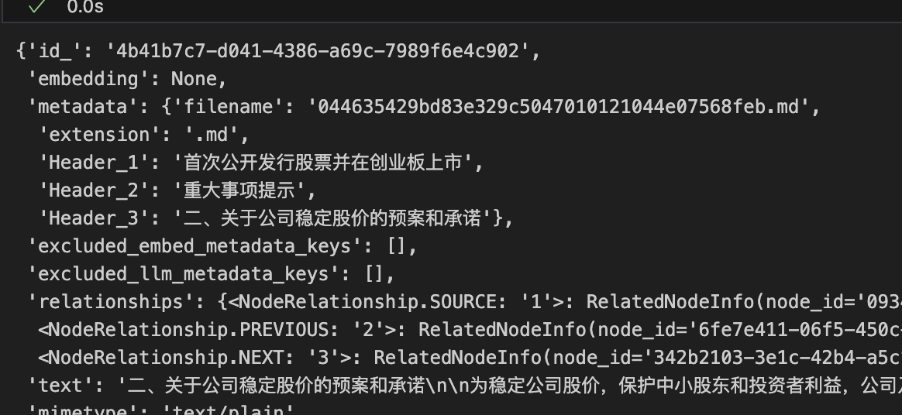

```shell
python scripts/pdf_preprocessing.py
```


Here we did 2 thins:

	1. Added company_name as header1 for those absent
	1. Removed header1 that not company_name

After preprocessing, we now make sure company_name is the **only header1**

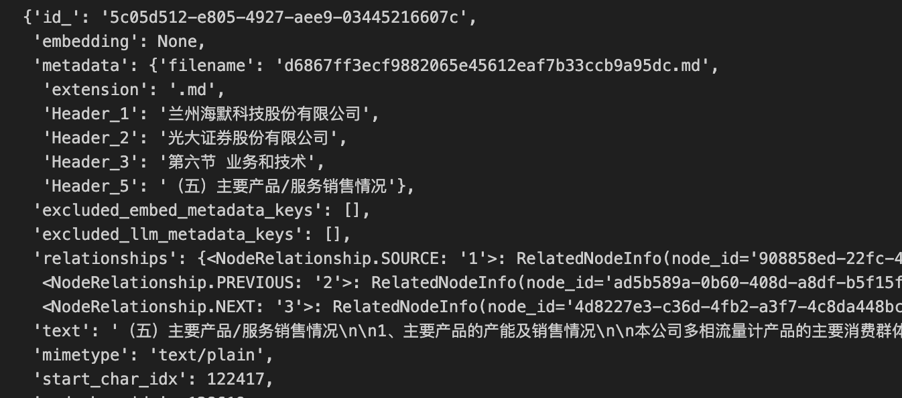

If you want to access the first time use RAG module, vectorlize the documents by running

```shell
python scripts/vectorlize_markdown.py
```


## RAG Demo

use llama3.2 3B as base model:

### without RAG:

```markdown
>>> 介绍一下武汉力源信息技术股份有限公司
**关于武汉力源信息技术股份有限公司**

武汉力源信息技术股份有限公司是一家中国 headquartered 的信息技术公司，主要从
事软件开发、销售和服务。公司成立于1999年，总部位于中国湖北省武汉市。

**业务范围**

力源信息技术股份有限公司的业务范围广泛，包括：

* **软件开发和研究**:  Force Source 主要提供各类软件产品，例如办公管理系统、
人工智能等。
* **销售和服务**:  Force Source 在全国范围内提供软件销售和支持服务。
* **外部服务**:  Force Source 也为其他公司提供技术咨询和应用service。

**主要产品**

Force Source 的主要产品包括：

* **ForceOS**：是一种办公管理系统，用于提高企业的 productivity 和效率。
* **Fusion**：是一种人工智能解决方案，用于帮助企业做出数据驱动决策。
* **Mosaic**：是一种智能硬件平台，用于为 IoT 设备提供智能服务。

**合作伙伴**

Force Source 以其强大的技术能力和广泛的合作伙伴网络而著名。公司已经与许多国
内外知名企业合作，包括中国百联、中国电信、中国 Telecom等。

**发展目标**

Force Source 的长期发展目标是成为全球领先的信息技术服务提供商，通过创新和高
效的运营，为客户提供高质量的软件产品和服务
```


### With RAG

```markdown
>>> 介绍一下武汉力源信息技术股份有限公司

武汉力源信息技术股份有限公司是一家专注于半导体集成电路和电子元器件的公司，注册资本为人民币5,000 万元。公司由赵马克担任法定代表人，主要运营范围包括电子产品、电子元器件、信息技术及相关成套产品方案的开发、研制、生产、销售及技术服务。公司的主营业务是推广、销售和应用服务于半导体集成电路等电子元器件。
```


### Result of Different Chunking Strategys

Example:

```
Question: 湖南长远锂科股份有限公司变更设立时作为发起人的法人有哪些？
```

Ground Truth:

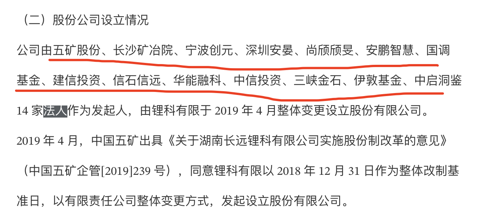

1. Simple chunking

   ```json
   "answer": "湖南长远锂科股份有限公司变更设立时作为发起人的法人包括余春明、余超彪等78名自然人。"
   ```

   

2. Semantic chunking

   ```json
   "answer": "湖南长远锂科股份有限公司变更设立时，作为发起人的法人包括五矿股份、长沙矿冶院、宁波创元、深圳安晏、尚颀颀旻、安鹏智慧、国调基金、建信投资、信石信远、华能融科、中信投资、三峡金石、伊敦基金和中启洞鉴这14家法人。"
   ```

   

   

## Some Interesting Problems Met in Data Preprocessing

- This kind of PDF shadow-style format can cause errors when extracting text

  <figure class="half">
    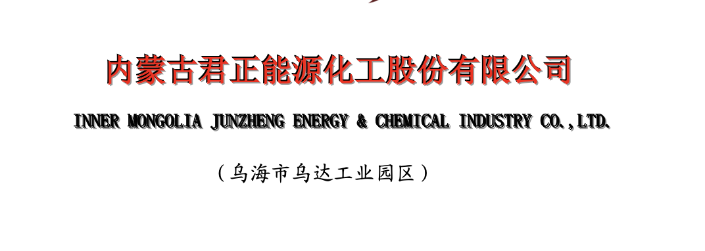
    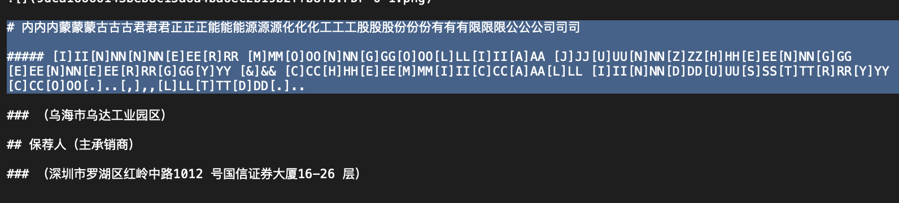
  </figure>
  <figure class="half">
    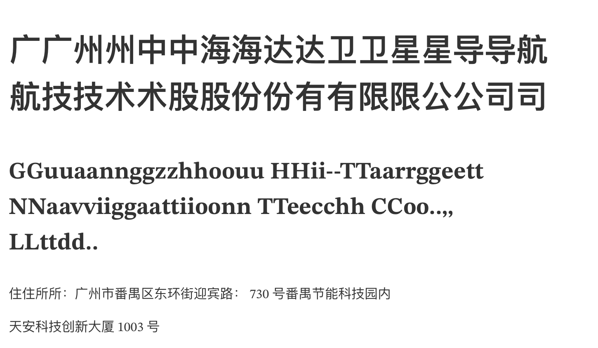
    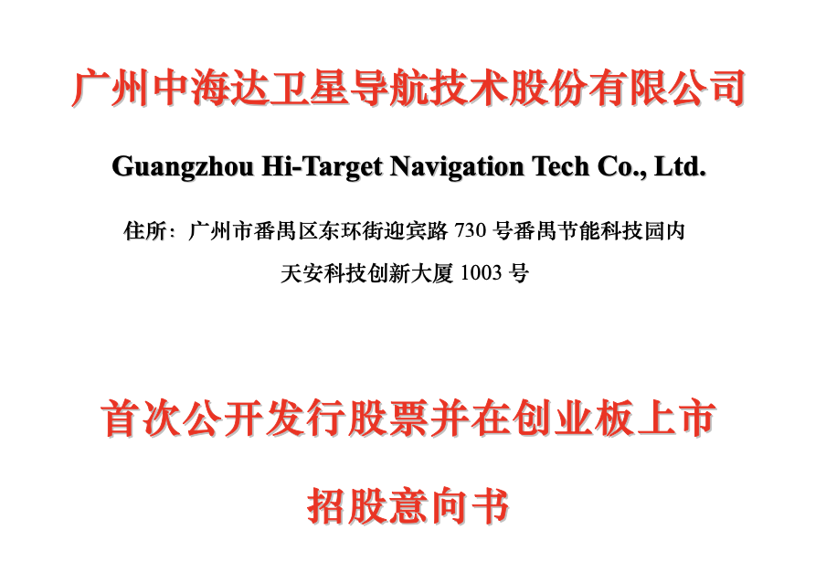
  </figure>
  
  
- Head title missing because title contained in Image

  <figure class="half">
    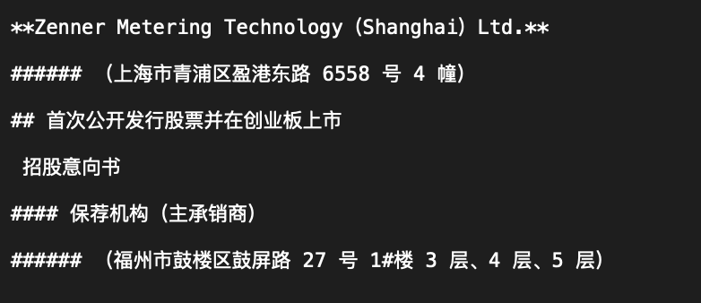
    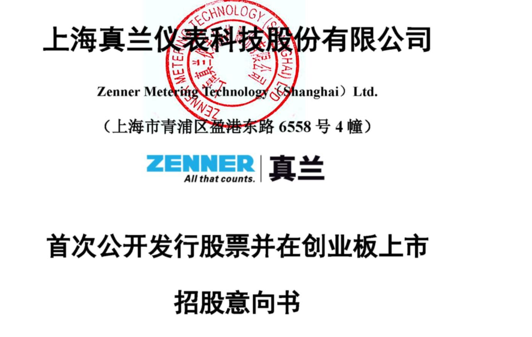
  </figure>
  
  

## SQL

As the column name contains special symbol like "(" ")", which lead to a **SQL Parsing Error**, it is necessary to add **double quotes** to avoid.

For example：

we need to change

```sqlite
SELECT 股票代码, MAX(最高价(元)) AS 最高价 FROM `港股票日行情表` GROUP BY 股票代码 ORDER BY 最高价 DESC LIMIT 1;
```

To 

```sqlite
SELECT "股票代码", MAX("最高价(元)") AS 最高价 FROM `港股票日行情表` GROUP BY "股票代码" ORDER BY 最高价 DESC LIMIT 1;
```

As "最高价(元)" will be parse as a function "最高价()" instead of a column name


Use a prompt engineering to solve this problem:
Before prompt:
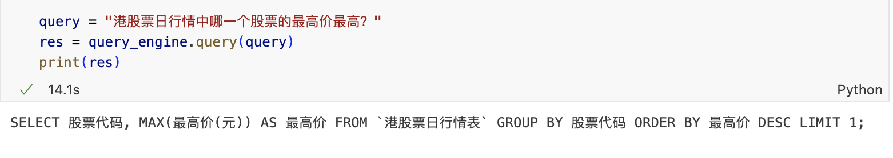

After Prompt:

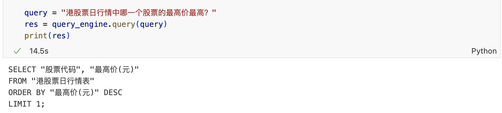

## Fine-tuning

For Efficient Fine-tuning, we use the [Llama-Factory](https://github.com/hiyouga/LLaMA-Factory) project as solution

### Preparation

without fine-tuning

```markdown
query: 请帮我计算，在20210105，中信行业分类划分的一级行业为综合金融行业中，涨跌幅最大股票的股票代码是？涨跌幅是多少？百分数保留两位小数。股票涨跌幅定义为：（收盘价 - 前一日收盘价 / 前一日收盘价）* 100%

response:  SQL查询
Company: NULL
Keywords: 20210105 一级行业为综合金融 中信行业分类 涨跌幅最大 股票代码 涨跌幅
TextQueryForSQL: SELECT T1.股票代码, ((T1.收盘价 - T2.昨收盘(元)) / T2.昨收盘(元)) * 100 AS 涨跌幅 FROM A股公司行业划分表 AS T1 JOIN A股票日行情表 AS T2 ON T1.股票代码 = T2.股票代码 WHERE T1.交易日期 = '20210105' AND T1.一级行业名称 = '综合金融' ORDER BY 涨跌幅 DESC LIMIT 1 解析步骤如下：

1. **确定查询目标**：
   - 需要找出20210105日期时，中信行业分类的一级行业为综合金融中的涨跌幅最大股票的股票代码及涨跌幅。

2. **数据来源**：
   - 使用`A股公司行业划分表`获取股票代码、交易日期、行业划分标准、一级行业名称等信息。
   - 使用`A股票日行情表`
```


